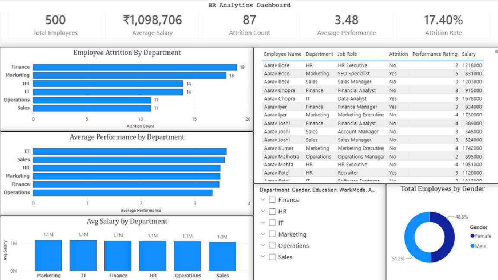

# 👨‍💼 HR Analytics Dashboard

## 📌 Project Overview

This Power BI dashboard analyzes employee data to help HR teams monitor workforce trends, employee performance, salary distribution, and attrition.

---

# 📊 Dashboard Preview

---

## 🎯 Business Questions Answered

- How many employees are in the organization?
- What is the employee attrition rate?
- Which department has the highest attrition?
- What is the average employee salary?
- What is the average performance rating?
- How is the workforce distributed by gender?

---

## 📈 KPIs

- 👥 Total Employees
- 🚪 Attrition Count
- 📉 Attrition Rate
- 💰 Average Salary
- ⭐ Average Performance

---

## 📊 Dashboard Features

- Interactive slicers
- Department-wise attrition analysis
- Gender distribution
- Salary analysis
- Performance analysis
- Employee details table

---

## 🛠️ Tools Used

- Power BI
- DAX
- Microsoft Excel

---

## 📁 Files Included

- HR_Analytics.pbix
- HR_Analytics_Dashboard.png
- HR_Analytics_Dataset.xlsx

---

## 💡 Key Insights

- Finance department recorded the highest attrition.
- Overall attrition rate is 17.4%.
- Average employee salary is approximately ₹11 lakh.
- Gender distribution is nearly balanced.
