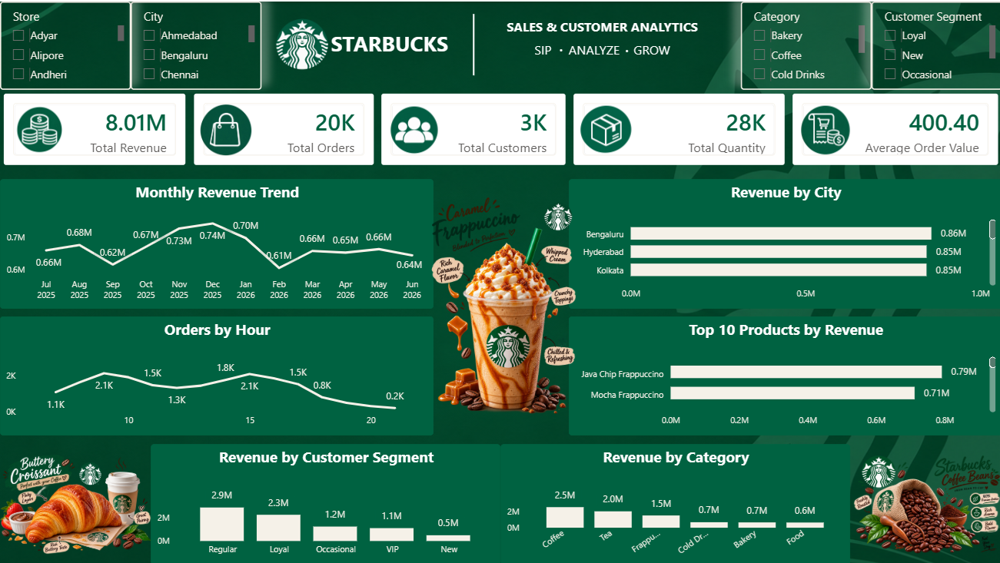

# ☕ Starbucks Sales & Customer Analytics

An interactive Power BI dashboard designed to analyze Starbucks sales performance, customer behavior, product performance, and ordering patterns.

## 📊 Dashboard Preview

## 🛠️ Tools & Technologies

- Power BI
- DAX
- SQL
- Data Visualization
- Data Analysis

## 📌 Key Performance Indicators

- **Total Revenue:** 8.01M
- **Total Orders:** 20K
- **Total Customers:** 3K
- **Total Quantity:** 28K
- **Average Order Value:** 400.40

## 📈 Dashboard Analysis

The dashboard provides insights into:

- Monthly revenue trends
- Revenue by city
- Orders by hour
- Top 10 products by revenue
- Revenue by customer segment
- Revenue by category

## 🎛️ Interactive Filters

Users can interact with the dashboard using:

- Store
- City
- Category
- Customer Segment
- Date range

All visuals respond dynamically to the selected filters.

## 💡 Key Insights

- Bengaluru generates the highest revenue among the displayed cities.
- Java Chip Frappuccino is the top-performing product by revenue.
- Regular customers contribute the highest revenue among customer segments.
- Coffee generates the highest revenue among the displayed categories.
- Order activity varies significantly throughout the day.

## 🎨 Dashboard Design

The dashboard uses a Starbucks-inspired visual theme with:

- Starbucks green color palette
- Custom KPI icons
- Product and food visuals
- Interactive Power BI visuals
- Consistent typography and layout

## 📂 Project Files

| File | Description |
|---|---|
| `Starbucks_Dashboard.pbix` | Power BI dashboard |
| `Dashboard_Screenshot.png` | Dashboard preview |
| `starbucks_data.csv` | Dataset used for analysis |

## 🎯 Project Objective

The objective of this project was to transform raw sales data into an interactive business intelligence dashboard that helps understand revenue performance, customer behavior, product performance, and ordering patterns.

## 👤 Author

**Anmol Arora**

Aspiring Data Analyst skilled in SQL, Excel, Power BI, and DAX.
